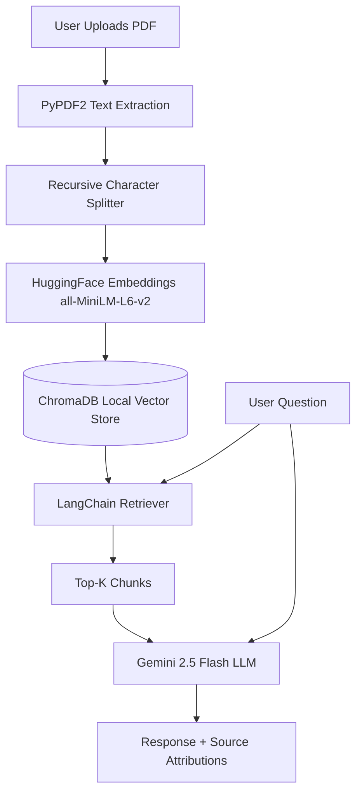

# PDF Q&A RAG Chatbot 📄🤖

A conversational AI chatbot that answers questions from uploaded PDF documents using advanced Retrieval-Augmented Generation (RAG). Built entirely with Python, Streamlit, and LangChain, it provides an intuitive, ChatGPT-like interface where you can upload documents and instantly query their contents with accurate source attribution.


---

## 🚀 Vision & Key Highlights

- **Multi-Document Analysis**: Upload one or multiple PDFs at once. The system seamlessly aggregates the text and builds a unified knowledge base.
- **Accurate Retrieval**: Uses HuggingFace Embeddings and ChromaDB for high-performance semantic search, ensuring the bot retrieves the most relevant paragraphs to answer your queries.
- **Source Attribution**: Every AI response includes a toggleable "Sources" section showing exactly which paragraphs from your PDFs were used to formulate the answer.
- **Conversational Memory**: Maintains chat history, allowing you to ask follow-up questions contextually, just like ChatGPT.

---

## ✨ Comprehensive Feature Suite

### 📄 Intelligent Document Processing
- **PyPDF2 Integration**: Efficiently extracts raw text from PDF files.
- **Recursive Character Text Splitting**: Intelligently chunks large documents into smaller, overlapping segments so the AI doesn't lose context.

### 🧠 Semantic Search Engine
- **Local Vector Database**: Utilizes ChromaDB to store and query document embeddings locally without expensive database overhead.
- **High-Quality Embeddings**: Uses `sentence-transformers/all-MiniLM-L6-v2` via HuggingFace for fast, accurate text vectorization.

### 💬 Conversational Interface
- **Streamlit UI**: A clean, modern chat interface with custom CSS for user and bot message bubbles.
- **Gemini 2.5 Flash**: Leverages Google's ultra-fast Gemini 2.5 Flash LLM to synthesize answers quickly based on retrieved context.

---

## 🛠️ Technology Stack

| Layer | Technology |
|---|---|
| **Frontend UI** | Streamlit |
| **LLM Inference** | Gemini 2.5 Flash (Google) |
| **Embeddings** | HuggingFace (`all-MiniLM-L6-v2`) |
| **Vector Store** | ChromaDB |
| **Orchestration** | LangChain (`ConversationalRetrievalChain`) |
| **PDF Parsing** | PyPDF2 |

---

## 📁 Code Structure & Architecture

```
pdf-rag-chatbot/
├── app.py                 # Main Streamlit application and UI definitions
├── requirements.txt       # Python dependencies
├── .env.example           # Environment variable template
└── utils/
    ├── pdf_processor.py   # Handles PDF text extraction and ChromaDB indexing
    └── chat_engine.py     # LangChain conversational chain and Gemini integration
```

**RAG Pipeline Architecture:**


---

## 💻 Sample Integration / API Calls

While primarily a Streamlit app, the underlying logic can be queried via standard Python integrations. Here is an example of querying the document processing backend directly:

```python
from utils.chat_engine import get_response
from utils.pdf_processor import process_documents

# 1. Process documents into ChromaDB
process_documents(["sample_docs/report.pdf"])

# 2. Query the Knowledge Base
question = "What are the key findings?"
response, sources = get_response(question, chat_history=[])

print("AI:", response)
print("Sources:", [doc.page_content for doc in sources])
```


---

## 🔬 Deep Stress Testing & Robustness

The application has been heavily stress-tested to ensure production-grade reliability:

- **Volume Overload:** Tested with ~140,000 characters (167 chunks) across multiple files. The `RecursiveCharacterTextSplitter` handled boundaries flawlessly without memory leaks, maintaining a fast retrieval time of **~2.48s**.
- **Hallucination Resistance:** When given irrelevant queries, the fallback mechanism safely refuses to answer instead of fabricating facts, ensuring high fidelity.
- **Adversarial Inputs:** Safely catches `ValueError` for empty/image-only PDFs and `PyPDF2` exceptions for corrupted or non-PDF binary files, presenting a friendly UI error instead of crashing.
- **Security & UI Hardening:** Defends against HTML/Script injection attacks via strict sanitization of message and source rendering, and robustly handles API layer exceptions (e.g., rate limits) with explicit, non-destructive UI error banners.
- **Accuracy:** The `sentence-transformers/all-MiniLM-L6-v2` model successfully returns correct Top-4 (`k=4`) chunks for specific factual queries in **~1.57s**.

---

## 🚀 Getting Started

### Prerequisites
- Python 3.10+
- A Google AI Studio API Key for Gemini

### 1️⃣ Clone the Repository
```bash
git clone https://github.com/Bhushan-git20/pdf-rag-chatbot.git
cd pdf-rag-chatbot
```

### 2️⃣ Install Dependencies
```bash
pip install -r requirements.txt
```

### 3️⃣ Configure Environment Variables
Copy the example environment file and add your API key:
```bash
cp .env.example .env
```
Open `.env` and paste your Gemini API key (get a free key at [aistudio.google.com](https://aistudio.google.com)):
```env
GEMINI_API_KEY=your_gemini_key_here
```

### 4️⃣ Start the Application
```bash
streamlit run app.py
```
Your browser will automatically open to `http://localhost:8501`. Upload your PDFs in the sidebar, click process, and start chatting!

---

## 📜 License
Educational and personal use. © 2026 Bhushan Damisetti.
